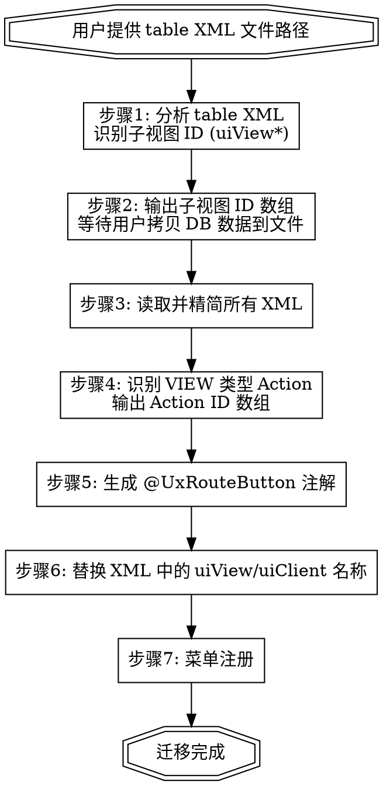

# Oinone XML View Migration

## Overview

将 Oinone 平台数据库中的 XML 视图迁移到代码文件，包括 XML 精简、子视图收集、Action 注解生成和菜单注册。

## When to Use

- 用户提供一个 table 类型的 XML 文件路径，要求进行视图迁移
- 用户提到"XML 迁移"、"视图迁移"、"migrate XML"

## 完整流程



## 步骤详解

### 步骤1: 分析 table XML

读取用户提供的 table XML 文件，识别其中引用的子视图（`name` 以 `uiView` 开头的 action）。

### 步骤2: 收集子视图 XML

将需要从 DB 获取的子视图 ID 以数组字符串格式输出：
```
['uiView37fbd4a147e54facb037636e3fa5953a', 'uiView5538c50199d54e7296008025986bf941']
```

用户会将 XML 从 DB 拷贝到文件中，然后提供文件路径。直接读取该文件获取内容。每次只请求一批，用户回复后再继续。

### 步骤3: 精简 XML

对所有 XML 文件（table + 子视图）应用精简规则，精简后直接覆盖写回原文件。

#### 精简规则 — 可去除的默认属性

| 属性 | 默认值 | 适用元素 |
|------|--------|----------|
| `disabled` | `"false"` | field, template, action, pack |
| `invisible` | `"false"` | field, template, action, pack |
| `readonly` | `"false"` | field, template, action, pack |
| `required` | `"false"` | field, template, action, pack |
| `allowClear` | `"true"` | field |
| `allowSearch` | `"true"` | field |
| `autoFillOptions` | `"true"` | field |
| `widget` | 可从字段类型推断 | field（如 Integer, Input, Select, Related, Currency） |
| `showThousandth` | `"false"` | field（数值类型） |
| `statistics` | `"false"` | field（数值类型） |
| `closeAllDialog` | `"true"` | action |
| `closeAllDrawer` | `"true"` | action |
| `closeDialog` | `"true"` | action |
| `closeDrawer` | `"true"` | action |
| `refreshData` | `"true"` | action |
| `validateForm` | `"true"` | action |
| `cancelText` | `"取消"` | action |
| `displayName` | 与 label 重复时 | option |

**注意：** `invisible` 为动态表达式时（如 `invisible="activeRecord.status != 'SUBMITTED'"`）必须保留。

遇到不确定是否应去除的属性，使用 `AskUserQuestion` 与用户确认。

### 步骤4: 识别 Action 并收集定义

识别 XML 中 `name` 以 `uiView` 开头的 action（`action_type` 为 `VIEW` 的路由动作），将 Action ID 以数组格式输出：
```
['uiView37fbd4a147e54facb037636e3fa5953a']
```

用户会在对话中贴出 Action 定义的 JSON 数组：
```json
[
  {
    "model": "pamirs.market.view.customer.MarketCusProxyOrder",
    "display_name": "取消",
    "name": "uiView37fbd4a147e54facb037636e3fa5953a",
    "action_type": "VIEW",
    "target": "dialog",
    "res_view_name": "我的订单-取消订单【自定义】_FORM_uiView500325df052a40678e9eb436c2130056",
    "context_type": "SINGLE"
  }
]
```

### 步骤5: 生成 @UxRouteButton 注解

#### 5.1 确定命名
使用 `AskUserQuestion` 向用户推荐语义化的 `name`/`viewName`（基于 `display_name` 和上下文推断），同时支持用户自定义。

#### 5.2 确定目标文件
根据 JSON 中的 `model` 字段，在项目中搜索带有 `@Model.model(对应模型.MODEL_MODEL)` 注解的 Action 类。使用 `AskUserQuestion` 与用户确认写入哪个文件。如果 Action 类不存在，与用户确认是否需要新建。

#### 5.3 写入注解
在 Action 类上添加 `@UxRouteButton` 注解，一个类可叠加多个：

```java
@UxRouteButton(
        action = @UxAction(name = "{语义化名称}", displayName = "{display_name}", label = "{display_name}", contextType = ActionContextTypeEnum.{context_type}),
        value = @UxRoute(model = {模型类名}.MODEL_MODEL, viewName = "{语义化名称}", openType = ActionTargetEnum.{target映射})
)
```

#### 字段映射

`target` → `ActionTargetEnum`:

| target | 枚举值 |
|--------|--------|
| router | ROUTER |
| dialog | DIALOG |
| drawer | DRAWER |
| inner | INNER |
| openWindow | OPEN_WINDOW |

`context_type` → `ActionContextTypeEnum`:

| context_type | 枚举值 |
|-------------|--------|
| SINGLE | SINGLE |
| BATCH | BATCH |
| SINGLE_AND_BATCH | SINGLE_AND_BATCH |
| CONTEXT_FREE | CONTEXT_FREE |

`label` 始终与 `displayName` 一致，取自 `display_name`。
`model` 使用 `{模型类名}.MODEL_MODEL` 常量。

### 步骤6: 替换 XML 中的名称

#### 6.1 替换 uiView
将所有 XML 中 `name="uiView..."` 替换为步骤5中确定的语义化名称。包括：
- table XML 中 action 的 `name` 属性
- 子视图 XML 的 `<view>` 标签需添加 `name="{语义化名称}"` 属性

#### 6.2 替换 uiClient
将所有 XML 中 `name="uiClient..."` 的 action 统一替换为 `name="$$internal_GotoListTableRouter"`。适用于：
- table XML 内联 dialog 中的关闭/取消类 action
- 独立子视图 XML 中的关闭/取消类 action

### 步骤7: 菜单注册

#### 7.1 确定 Menus 类
根据 XML 所在模块自动查找对应的 Menus 类：
- `pamirs-market-customer` 模块 → `MarketCustomerMenus`
- `pamirs-market-developer` 模块 → `MarketDeveloperMenus`

不确定时使用 `AskUserQuestion` 确认。

#### 7.2 获取菜单信息
使用 `AskUserQuestion` 向用户获取菜单名称和层级结构。

#### 7.3 写入菜单注册
在 Menus 类中添加嵌套的 `@UxMenu` 注解：

```java
@UxMenu("一级菜单名")
public static class LevelOne {
    @UxMenu("二级菜单名")
    @UxRoute(model = {模型类名}.MODEL_MODEL)
    public static class LevelTwo {
    }
}
```

## 文件命名与目录规则

- 子视图 XML 文件名：viewName 的蛇形转换，如 `customerOrderDetail` → `customer_order_detail.xml`
- 目录：按菜单/功能分目录，放在 `template/{功能目录}/` 下，与 table XML 同目录

## Rules

1. 全程与用户保持交互，不擅自假设任何数据内容
2. 需要用户从 DB 拷贝的数据，严格以数组字符串格式输出
3. 每次等用户回复后再进行下一步，不跳步
4. 精简 XML 时遇到不确定的属性，必须通过 `AskUserQuestion` 确认
5. Action 的命名和目标文件都必须通过 `AskUserQuestion` 与用户确认后再写入
6. 菜单注册的 Menus 类不确定时必须通过 `AskUserQuestion` 确认