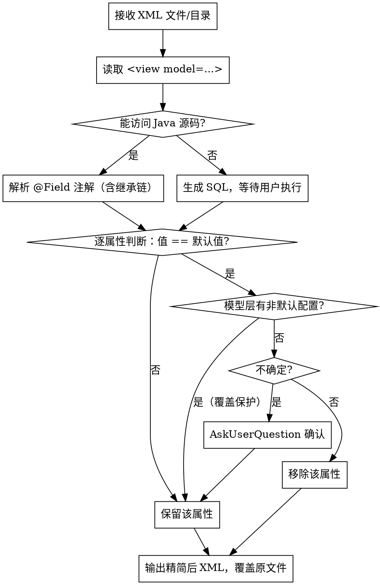

# 精简 Oinone 界面设计器导出的 XML 文件

## Overview

将 oinone-pamirs 界面设计器导出的视图 XML 文件中等于框架默认值的冗余属性移除，同时通过覆盖保护机制防止误删用户有意配置的属性。

**核心原则：宁可多保留，不可误删除。**

---

## 默认值规则（源码推导）

### 一、`<field>` 元素默认属性

基于 `UIField`、`UIWidget`、`UILayoutCell`、`RegisterViewEditor.makeUiField()` 源码：

| 属性 | 默认值 | 说明 |
|------|--------|------|
| `invisible` | `false` | 不设置 = 显示 |
| `readonly` | `false` | 不设置 = 可编辑 |
| `required` | `false` | 不设置 = 非必填 |
| `disabled` | `false` | 不设置 = 启用 |
| `multi` | `false` | 不设置 = 单值 |
| `store` | `true` | 不设置 = 存储 |
| `autoFill` | `false` | 不设置 = 不自动填充 |
| `autoFillOptions` | `true` | 自动填充选项（默认开启） |
| `allowClear` | `true`（前端默认） | 允许清除 |
| `allowSearch` | `true`（前端默认） | 允许搜索 |
| `showCount` | `false` | 不显示字符计数 |
| `patternType` | `NONE` | 无格式校验 |
| `colSpan` | `QUARTER`（表格列）/ `1`（表单字段） | 占据栅格数 |
| `type` | `TEXT`（字符串默认） | 字段展示类型 |

**说明：**
- `widget` 的默认值依赖字段的 `ttype`（见下方 widget-ttype 映射），若 XML 中的 `widget` 值与该字段 ttype 的框架默认 widget **相同**，则可移除。
- `label` = 字段的 `displayName`（模型元信息）时可移除，但需确认（字段标题改变会影响展示）。

### 二、可直接删除白名单

以下规则为明确白名单，可直接删除，无需二次确认：

| 场景                                   | 可删除属性/取值                 |
|--------------------------------------|--------------------------|
| 通用 `<field>`                         | `allowClear="true"`      |
| 通用 `<field>`                         | `allowSearch="true"`     |
| 通用 `<field>`                         | `autoFillOptions="true"` |
| 数值字段（仅 `ttype=integer/long`）         | `widget="Input"`         |
| 多值关联字段（仅 `ttype=one2many/many2many`） | `widget="Select"`        |

**范围约束（必须遵守）：**
- “数值类型”仅指 `integer`、`long`，不包含 `float`、`money`、`decimal`。
- `widget="Select"` 的白名单仅适用于 `one2many`、`many2many`，**不适用于 `many2one`**。
- 白名单之外（包括“等等”扩展项）一律视为不确定，必须使用 `AskUserQuestion` 进行苏格拉底式澄清后再处理。

### 三、widget 与 ttype 默认映射（源码 `WidgetEnum`）

框架在 `RegisterViewEditor.makeUiField()` 中调用 `fetchDefaultWidget()`，对普通字段 widget 默认为 `null`（由前端根据 ttype 决定），对特殊业务模型（地址/公司/部门/员工/角色）有特定 widget。

**可安全移除的 widget 值（当其等于以下默认映射时）：**

| ttype                    | 默认 widget（可移除）         |
|--------------------------|------------------------|
| `string`                 | `Input`                |
| `text`                   | `TextArea`             |
| `html`                   | `RichText`             |
| `integer` / `long`       | `Integer`              |
| `float` / `money`        | `Float` / `Currency`   |
| `boolean`                | `Switch` 或 `CheckBox`  |
| `date`                   | `DatePicker`           |
| `datetime`               | `DateTimePicker`       |
| `time`                   | `TimePicker`           |
| `enum`                   | `Select`               |
| `many2one`               | `Select`               |
| `one2many` / `many2many` | `Table`                |
| `binary`                 | `Upload` 或 `UploadImg` |

**补充：** 除上述默认映射外，按“可直接删除白名单（已确认）”执行额外删除规则（如 `one2many/many2many` 的 `widget="Select"`、`integer/long` 的 `widget="Input"`）。

**不可轻易移除的 widget（用户主动配置）：** `TableSelect`、`Radio`、`RangeDatePicker`、`Password`、`Phone`、`Email`、`Tree` 等非默认 widget，必须保留。

### 四、`<action>` 元素默认属性

| 属性 | 默认值 | 说明 |
|------|--------|------|
| `invisible` | `false` | 不隐藏 |
| `disabled` | `false` | 不禁用 |

### 五、`<options>` 内部规则

- `displayName` 与 `label` 或 `name` 的值相同时，`displayName` 可移除（从 `UiViewUtils.fillDictionaryOption()` 推导：displayName 是从 dictionaryItem 填充的，与 label/name 往往重复）
- **不确定时，保留，向用户确认**

### 六、特殊字段（不可精简的系统默认行为）

基于 `compileAbstractFields()` 源码，以下属性由框架强制写入，是**有意的非默认值**，禁止移除：

| 字段 | readonly | invisible |
|------|----------|-----------|
| `id` | `true` | `true` |
| `createDate` | `true` | `true`（仅 form 视图） |
| `writeDate` | `true` | `true`（仅 form 视图） |

---

## 覆盖保护机制（关键）

当 XML 中某属性值"看似是默认值"，但对应 Java 模型的 `@Field` 注解中配置了非默认值时，XML 中的值是**有意覆盖**，禁止移除。

### 执行步骤

```
1. 读取 XML 中 <view model="xxx"> 的 model 属性
2. 在项目源码中定位该 Java 模型类（含完整继承链）
3. 解析模型类及其父类的 @Field 注解配置
4. 逐字段对比：
   - @Field(invisible=true) → XML 中 invisible="false" 是覆盖，必须保留
   - @Field(required=true)  → XML 中 required="false" 是覆盖，必须保留
   - @Field(readonly=true)  → XML 中 readonly="false" 是覆盖，必须保留
```

**@Field 注解关键字段默认值（`Field.java` 源码）：**

| 注解字段 | 默认值 |
|---------|--------|
| `required` | `false` |
| `invisible` | `false` |
| `immutable` | `false` |
| `translate` | `false` |

### 回退方案（无法访问源码时）

生成如下 SQL 交给用户执行，仅获取必要字段：

```sql
SELECT name, field, ttype, required, invisible, immutable
FROM base_field
WHERE model = '对应模型编码'
  AND is_deleted = 0;
```

根据用户返回的结果，继续判断是否为覆盖配置。

---

## 执行流程



---

## 精简示例

**精简前：**
```xml
<field allowClear="true" allowSearch="true" autoFillOptions="false" colSpan="QUARTER"
       data="id" disabled="false" invisible="true" label="订单ID"
       patternType="NONE" readonly="true" required="false" showCount="false"
       type="TEXT" widget="Input"/>
```

**精简后（id 字段：invisible/readonly 是框架强制值，需保留；其余均为默认值）：**
```xml
<field data="id" invisible="true" label="订单ID" readonly="true"/>
```

**精简前（普通字符串字段）：**
```xml
<field allowClear="true" allowSearch="true" autoFillOptions="false" colSpan="QUARTER"
       data="name" disabled="false" invisible="false" label="姓名"
       patternType="NONE" readonly="false" required="false" showCount="false"
       type="TEXT" widget="Input"/>
```

**精简后：**
```xml
<field data="name" label="姓名"/>
```

---

## 安全策略

- **遇到不确定情况，必须使用 `AskUserQuestion` 工具向用户确认**，不可擅自删除
- 批量处理时，每个文件独立判断，不跨文件假设
- 直接覆盖原文件前，可提示用户备份（但不强制）
- **若 `widget` 值非标准默认（如 `TableSelect`、`Radio`），必须保留**
- `label` 属性若与字段 `displayName` 完全一致，需询问用户是否移除，不可自动删除

## 常见错误

| 错误                                                 | 正确做法                      |
|----------------------------------------------------|---------------------------|
| 删除 `id` 字段的 `invisible="true"`                     | 保留，这是框架强制设置的有意值           |
| 删除 `widget="TableSelect"`                          | 保留，用户主动配置的非默认 widget      |
| 删除 `required="false"` 而未检查 `@Field(required=true)` | 先检查模型注解再决定                |
| 将 `label` 与 `displayName` 不同时仍删除                   | `label` 不同说明用户自定义了标题，必须保留 |
| 删除 `invisible="false"` 而模型层 `invisible=true`       | 这是覆盖配置，必须保留               |
